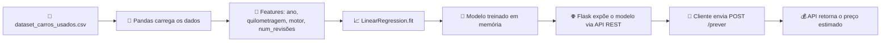

# Projeto-final-analise-dados

# 🚗💰 Previsão de Preços de Carros Usados
### API inteligente que estima o valor de um veículo usado com Machine Learning

[](https://www.python.org/)
[](https://flask.palletsprojects.com/)
[](https://scikit-learn.org/)
[](https://pandas.pydata.org/)
[]()


**[📖 Sobre](#-sobre-o-projeto)** •
**[⚙️ Como funciona](#️-como-o-modelo-funciona)** •
**[🚀 Instalação](#-instalação-e-execução)** •
**[📡 Endpoints](#-documentação-da-api)** •
**[🧪 Exemplos](#-exemplos-práticos-de-uso)** •
**[🗺️ Roadmap](#️-roadmap)**

---

## 📖 Sobre o Projeto

Já imaginou perguntar a uma API *"quanto vale esse carro?"* e receber uma resposta em milissegundos, baseada em dados reais de milhares de veículos? **É exatamente isso que este projeto faz.**

Este é o **projeto final** de um percurso de estudos em Análise de Dados e Inteligência Artificial, e reúne, em uma única aplicação, todo o ciclo de um produto de Data Science:

```
📊 Dados brutos  →  🧹 Análise e preparação  →  🤖 Treinamento do modelo  →  🌐 API em produção
```

O resultado é uma **API REST construída com Flask** que expõe um modelo de **Regressão Linear** (Scikit-Learn), treinado sobre uma base real de carros usados, capaz de prever o **preço estimado de um veículo** a partir de quatro características simples: ano, quilometragem, motor e número de revisões.

> 🎯 **Em resumo:** não é só um notebook de estudo — é um serviço de Machine Learning pronto para ser consumido por qualquer front-end, aplicativo ou sistema externo.

---

### 🧠
**Modelo Preditivo**
Regressão Linear treinada com `scikit-learn` sobre dados reais de carros usados

### ⚡
**API Rápida e Leve**
Backend em Flask com CORS habilitado, pronto para integração com qualquer front-end

### 📦
**Pronto para Deploy**
Inclui `gunicorn` nas dependências — pronto para produção em serviços como Render, Railway ou Heroku

---

## 🗂️ Estrutura do Projeto

```
Projeto-final-analise-dados/
│
├── 🐍 app.py                       # API Flask + treinamento do modelo de ML
├── 📊 dataset_carros_usados.csv    # Base de dados com os carros usados
├── 📋 requirements.txt             # Dependências do projeto
├── 🚫 .gitignore                   # Arquivos ignorados pelo Git
└── 📄 README.md                    # Este documento
```

---

## ⚙️ Como o Modelo Funciona

O coração do projeto está em `app.py`. Ao iniciar a aplicação, o fluxo é o seguinte:



**Variáveis utilizadas pelo modelo (features):**

| Variável | Descrição | Tipo |
|---|---|---|
| `ano` | Ano de fabricação/modelo do veículo | Numérico |
| `quilometragem` | Quilometragem total rodada | Numérico |
| `motor` | Potência/cilindrada do motor | Numérico |
| `num_revisoes` | Quantidade de revisões realizadas | Numérico |

**Variável-alvo (target):** `preco` — o valor de mercado do veículo, que o modelo aprende a estimar.

---

## 🚀 Instalação e Execução

### ✅ Pré-requisitos

- [Python 3.10+](https://www.python.org/downloads/)
- [pip](https://pip.pypa.io/en/stable/installation/)
- [Git](https://git-scm.com/)

### 🔧 Passo a passo

```bash
# 1️⃣ Clone o repositório
git clone https://github.com/breno209/Projeto-final-analise-dados.git

# 2️⃣ Acesse a pasta do projeto
cd Projeto-final-analise-dados

# 3️⃣ Crie um ambiente virtual (recomendado)
python -m venv venv

# 4️⃣ Ative o ambiente virtual
source venv/bin/activate      # Linux/macOS
venv\Scripts\activate         # Windows

# 5️⃣ Instale as dependências
pip install -r requirements.txt

# 6️⃣ Execute a aplicação
python app.py
```

Se tudo ocorrer bem, você verá a API rodando em:

```
🌐 http://localhost:8000
```

---

## 📡 Documentação da API

### 🔹 `GET /`
Verifica se a API está online.

<details>
<summary><b>📥 Requisição</b></summary>

```bash
curl http://localhost:8000/
```

</details>

<details open>
<summary><b>📤 Resposta</b></summary>

```json
{
  "status": "API online e funcionando corretamente!",
  "Autor": "Breno"
}
```

---

### 🔹 `POST /prever`
Recebe as características de um veículo e retorna o **preço estimado**.

<details open>
<summary><b>📥 Requisição</b></summary>

```bash
curl -X POST http://localhost:8000/prever \
  -H "Content-Type: application/json" \
  -d '{
        "ano": 2019,
        "quilometragem": 45000,
        "motor": 2.0,
        "num_revisoes": 6
      }'
```

**Corpo da requisição (JSON):**

| Campo | Tipo | Exemplo | Obrigatório |
|---|---|---|:---:|
| `ano` | `int` | `2019` | ✅ |
| `quilometragem` | `int` | `45000` | ✅ |
| `motor` | `float` | `2.0` | ✅ |
| `num_revisoes` | `int` | `6` | ✅ |

```json
{
  "preço": 68450.32
}
```

</details>

<details>
<summary><b>⚠️ Resposta em caso de erro</b></summary>

```json
{
  "erro": "descrição do erro retornada pela exceção"
}
```

</details>

---

> 💡 **Dica:** você pode testar a API rapidamente com ferramentas como [Postman](https://www.postman.com/), [Insomnia](https://insomnia.rest/) ou o próprio `curl`.

---

## 🛠️ Stack Tecnológica


| Camada | Tecnologia |
|---|---|
| **Linguagem** |  |
| **Framework Web** |  |
| **Machine Learning** |  |
| **Manipulação de Dados** |   |
| **CORS** | Flask-CORS |
| **Servidor de Produção** | Gunicorn |

---

## 🌍 Deploy em Produção

O projeto já vem com `gunicorn` nas dependências, ou seja, está pronto para ser publicado em plataformas como:

<div align="center">

[](https://render.com/)
[](https://railway.app/)
[](https://www.heroku.com/)

```bash
# Exemplo de execução com gunicorn em produção
gunicorn app:app --bind 0.0.0.0:8000
```

---

## 🗺️ Roadmap

- [x] Análise e tratamento do dataset de carros usados
- [x] Treinamento do modelo de Regressão Linear
- [x] Construção da API REST com Flask
- [x] Endpoint de previsão de preços
- [ ] Validação e tratamento de entradas inválidas
- [ ] Testes automatizados (pytest)
- [ ] Comparação com outros algoritmos (Random Forest, XGBoost)
- [ ] Métricas de avaliação do modelo (MAE, RMSE, R²)
- [ ] Front-end simples para consumo da API
- [ ] Deploy público com link de demonstração

---

## 🤝 Como Contribuir

Contribuições são muito bem-vindas! Para colaborar:

1. 🍴 Faça um **fork** do projeto
2. 🌱 Crie uma branch (`git checkout -b feature/minha-feature`)
3. 💻 Faça suas alterações e commit (`git commit -m 'feat: minha nova feature'`)
4. 📤 Envie para o seu fork (`git push origin feature/minha-feature`)
5. 🔃 Abra um **Pull Request**

---

## 📜 Licença

Distribuído sob a licença **MIT**. Consulte o arquivo `LICENSE` para mais informações (ou sinta-se livre para estudar e reutilizar este código com os devidos créditos).

---

## 👤 Autor

**Breno209**
Desenvolvedor em formação, apaixonado por dados, IA e por transformar números em decisões inteligentes.

[](https://github.com/breno209)

---

link do meu projeto:https://road-price-predict.lovable.app

### ⭐ Gostou do projeto?

Deixe uma estrela no repositório — isso ajuda muito e motiva a continuar evoluindo o projeto!
